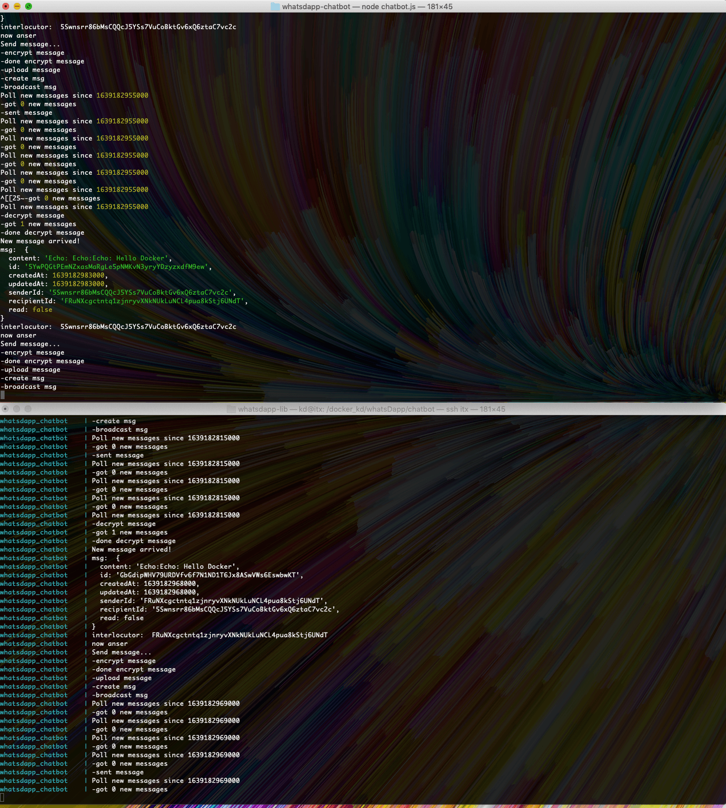

<p align="center">
  
</p>

<p align="center">
  Echo-Bot using the WhatsDapp library.
</p>

# WhatsDapp Echo-Bot

This development uses the [WhatsDapp library](https://github.com/realKidDouglas/whatsdapp-lib) to answer on every message for test and demo purpose.

## Running instance

There is a running instance with the identity `5LFWVvzMkiSJKFjuAGqSNUuMcA3hB1kS8Buw355VrzbM`.
If you have an initialized whatsDapp object `messenger` you can send messages acc. to [WhatsDapp's documentation](https://github.com/realKidDouglas/whatsdapp-lib):
```
messenger.sendMessage('5LFWVvzMkiSJKFjuAGqSNUuMcA3hB1kS8Buw355VrzbM', 'test-content')
```
Echo bot will answer as soon as it can ;)

If there is any trouble with this echo bot instance, just ping us on [Dash Devs Discord](https://chat.dashdevs.org/) on channel `#private-messenger`.


# Usage

Pre: You'll need a `testnet` Mnemonic and at least one toped up identity (see tutorials [here](https://dashplatform.readme.io/docs/tutorials-introduction)).

## Set Credentials

Edit `chatbot.js` and set the fields:
```
const MNEMONIC='<mnemonic goes here>'
const CHATBOT_IDENTITY='<identity goes here>'
```

That's it!

The supplied storage here (`LocalStorageClear`) does not have to be used.
You can use any key-value store according to whatsDapp's interface (`KVStore` defined in [`StructuredStorage`](https://github.com/realKidDouglas/whatsdapp-lib/blob/master/src/storage/StructuredStorage.ts)).
This one ist very easy and practicable for development.

## Run without Docker

To install dependencies: 
```
npm install
```

To run:
```
node chatbot.js
```

## Run with Docker

Run from root directory of this repo:
```
docker build -t whatsdapp-chatbot .
```

```
docker run -v ./storage:/storage -d whatsdapp-chatbot
```

(Install [Docker](https://docs.docker.com/get-docker/))


### Docker-Compose

Easier it gets with Docker-Compose.
All in one step is to use `docker-compose` from root directory of this repo: 
```
docker-compose up -d
```

If you made some changes in code (e.g. switching to "cleanup mode") you'll need to rebuild the docker-image:

```
docker-compose up -d --build
```

(Install [Docker-Compose](https://docs.docker.com/compose/install/))


### Logs

Find `<CONTAINER-NAME OR ID>` by running:
```
docker ps
```
Then follow logs from the last 100 lines:
```
docker logs --follow --tail 100 <CONTAINER-NAME OR ID>
```


# Gimmick

As soon as you have two instances running only one needs to cast the first stone and the ping-pong starts.

This are two bots one directly in node one in docker echoing each other.
They can do it for hours ;)


# License
[Licensed under the MIT License](https://opensource.org/licenses/MIT).
